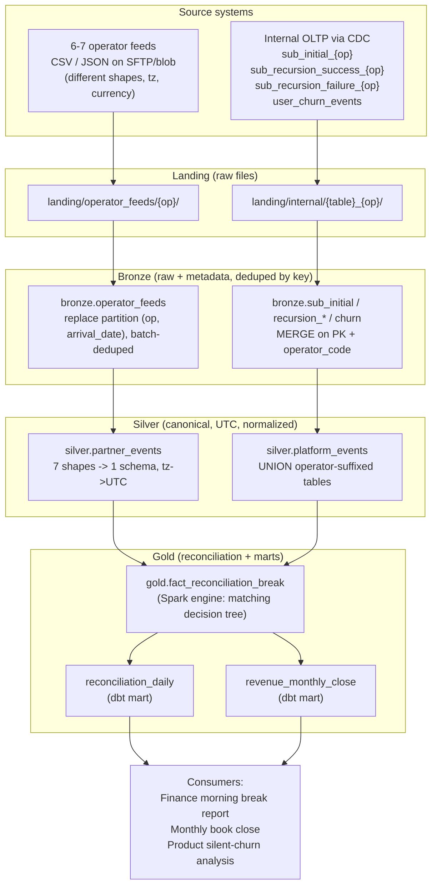
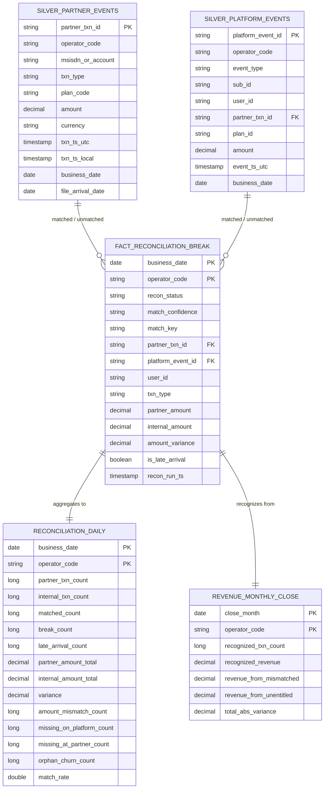
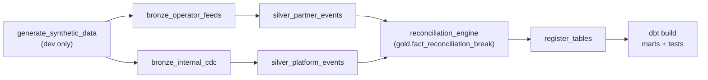

# 📊 Tapmad Payments Reconciliation – End-to-End Architecture (Airflow + PySpark + dbt + Delta Lake on MinIO + Hive Metastore)

> Lead Data Engineer take-home — Case Study: Payments reconciliation across
> partner and internal systems.

---

## 🧠 1. Problem Statement

Tapmad bills subscribers through 6–7 operators — mostly mobile network operators
(MNOs), plus a few card/wallet partners. Every transaction (initial charge,
renewal, refund, cancellation) exists **twice**:

- once in the **operator's** system — the source of truth for *money that moved*
- once in Tapmad's **internal platform** — the source of truth for
  *subscription status and entitlement*

The two drift. Partner webhooks fail, retries duplicate, partners refund without
telling us, users cancel directly with the operator, and timezones / batch
windows don't line up.

The job: a pipeline that produces, **every day, one reconciled view** of
subscriptions and revenue — telling Finance exactly **where** the two systems
disagree, **by how much**, and **why**.

| Source System | Description |
|---------------|-------------|
| Operator feeds (6–7) | Daily CSV/JSON drops, one per operator. The source of truth for money moved. |
| `sub_initial_{operator}` | Internal: new subscriptions (per-operator table) |
| `sub_recursion_success_{operator}` | Internal: successful renewals |
| `sub_recursion_failure_{operator}` | Internal: failed renewal attempts |
| `user_churn_events` | Internal: cancellations / churn |

What the business wants out of it:

- A single canonical event stream per side (partner vs platform)
- Every transaction classified: matched, or a specific kind of break
- The morning break report Finance opens each day
- A monthly revenue close, with an audit trail back to source rows
- A copy of the output pushed to object storage (S3/MinIO)

---

## 🎯 2. Deliverables

Build a daily (hourly-capable) pipeline that:

- Ingests 6–7 operator feeds (CSV/JSON) **+** the internal OLTP via CDC
- Lands raw data in a landing zone
- Loads it to **Bronze** (Delta on MinIO)
- Normalizes to **Silver** and reconciles in **Gold** (PySpark)
- Builds the Finance-facing marts in **dbt**
- Materializes the consumption table the business team opens each morning
- Drops Parquet snapshots of every table back to MinIO

Final tables:

```
gold.fact_reconciliation_break   -- row-level drill-down (every reconciled unit)
reconciliation_daily             -- the morning summary, per day per operator
revenue_monthly_close            -- the monthly book-close figure
```

dbt project: **staging** (sources over silver/gold) → **intermediate** →
**marts** (the two business tables) + **tests**.

---

## 📦 3. Input Data

**Source:** no real data is provided, so the pipeline runs on **synthetic CSV/
JSON** generated locally (`data/synthetic/generate_data.py`). The generator
plants every reconciliation scenario on purpose (matched, amount mismatch,
missing on either side, orphan churn, late arrival, null key, duplicate
re-send) so each `recon_status` actually shows up.

| Source | Side | Format | Notes |
|--------|------|--------|-------|
| `telco_a` / `telco_b` / `telco_d` / `wallet_y` | partner | CSV (comma / semicolon / epoch-millis / comma) | one file per operator per arrival date |
| `telco_c` / `wallet_x` | partner | JSON (`+04:00` offset / UTC `Z`) | different column names, tz, currency |
| `sub_initial_{op}` | internal | JSON (CDC) | new subscriptions |
| `sub_recursion_success_{op}` | internal | JSON (CDC) | successful renewals |
| `sub_recursion_failure_{op}` | internal | JSON (CDC) | failed renewal attempts |
| `user_churn_events` | internal | JSON (CDC) | cancellations |

A committed sample lives under [`data/sample/`](data/sample) — `business_date =
2024-01-15`, ~150 transactions, fixed seed (so it's deterministic and the
container regenerates the same files).

---

## ⚠️ 4. Constraints

**Technical**

- 6–7 feeds, each a different **shape / format / timezone / currency** (schema drift possible)
- The join key (`partner_txn_id`) is **sometimes missing** on the internal side
- Amounts are off by **rounding / FX** — "equal" needs a tolerance
- **Operator-local time vs platform-UTC** — the same event can land on two calendar dates
- The internal OLTP is **split per operator** (`sub_initial_telco_a`, `…_telco_b`, …)
- Operators **re-send the last few days as corrections** → must be **idempotent**, no double counting
- Must be able to **restate any past day** without changing an already-closed month
- Runs **daily** (and is built to go hourly)

**Business**

- Finance closes the books **monthly** on this output
- Product uses it to spot **silent churn** (still paying the operator but no longer entitled, or vice versa)

---

## 🧩 5. Assumptions and Approach

**Assumptions** (stated, then moved on — the brief says to do exactly this):

- `partner_txn_id` is unique *within* an operator → join on `(operator_code, partner_txn_id)`
- `business_date` is derived from the transaction's **UTC** time, not its file-arrival date
- Refunds arrive as their **own rows** (`txn_type = refund`), not as negative amounts
- `recursion_failure` is an **expected non-charge**, not a break
- "Same amount" means within **abs 0.01 or rel 0.5%** (rounding/FX tolerance)
- Only `status in (active, pending)` internal subs represent a real charge attempt

**Approach**

- A **medallion** (bronze → silver → gold) lakehouse on Delta
- **Config-driven** normalization: one generic job handles all operators (a new operator is a config entry, not new code)
- A **3-tier matching decision tree** in the gold engine (the hard part is *defining* "matched")
- **Idempotent-by-overwrite** ingestion so re-running self-corrects
- **PySpark** for the heavy lifting, **dbt** for the Finance-facing marts (SQL they can read + test)

---

## 🏗️ 6. High-Level Architecture

```
6–7 Operator feeds (CSV/JSON)          Internal OLTP (CDC, per-operator tables)
            |                                       |
            v                                       v
                    Local landing zone (raw files)
            |                                       |
            v                                       v
              Bronze  (Delta on MinIO, schema-on-read)
   operator feeds: replace partition          internal CDC: MERGE on PK
            |                                       |
            v                                       v
              Silver  (canonical, UTC, deduped)
   silver.partner_events                  silver.platform_events
                          \             /
                           v           v
              Gold engine  ->  fact_reconciliation_break   (3-tier matcher)
                                   |
                                   v
              dbt marts  ->  reconciliation_daily  +  revenue_monthly_close
                                   |
                                   v
        Finance morning report  ·  monthly close  ·  Product silent-churn
   (every layer registered in the shared Hive Metastore -> Trino / DBeaver)
```

The same flow as a medallion diagram:



| Layer | What it holds | Engine | Idempotency mechanism |
|------|----------------|--------|------------------------|
| **Landing** | raw files as dropped (local) | — | n/a |
| **Bronze** | raw rows + ingest metadata, schema-on-read | PySpark | operator feeds: `replaceWhere` per `(operator, arrival_date)`, batch-deduped; internal CDC: `MERGE` on PK |
| **Silver** | canonical, UTC, normalized events | PySpark | `replaceWhere` per `business_date` |
| **Gold (fact)** | reconciliation results, per-row | PySpark | `replaceWhere` per `business_date` |
| **Gold (marts)** | daily summary + monthly close | dbt | `reconciliation_daily` incremental per `business_date` (`replace_where` on Databricks, `insert_overwrite` locally); `revenue_monthly_close` full rebuild |

**Why split Spark vs dbt?** Bronze/silver/matching need imperative control
(timezone edge cases, multi-tier joins, window dedupe) — clearer and faster in
PySpark. The marts are SQL that **Finance can read, test, and trust**, so dbt
owns them with built-in tests and docs.

**Where it lives.** Bronze/silver/gold are Delta tables in **MinIO** (S3A), and
their definitions register in a **shared Hive Metastore**, so Trino/DBeaver hit
the same catalog. Landing files stay on local disk. It was local disk + an
embedded metastore to begin with; moving to MinIO + HMS was a config change in
`spark-defaults.conf` and `paths.py` — no pipeline logic touched.

### Data model (ERD)

The two canonical silver streams (`partner_events`, `platform_events`) feed
`fact_reconciliation_break` — one row per reconciled unit — which rolls up into
`reconciliation_daily` and `revenue_monthly_close`.



### Orchestration (Airflow DAG)



---

## 🔌 7. Integration — turning the 6–7 shapes into one schema

The whole "different shape per operator" problem is solved with **one
config-driven job**, not seven bespoke ones. See
[`spark/config/operator_config.py`](spark/config/operator_config.py).

Each operator gets one dict entry describing its column names, txn-type codes,
file format, timezone, currency, and timestamp encoding:

```python
"telco_b": {
    "file_format": "csv", "csv_options": {"sep": ";"},
    "timezone": "Asia/Karachi", "default_currency": "PKR",
    "column_map": {"txn_ref": "partner_txn_id", "charged_amount": "amount", ...},
    "txn_type_map": {"renewal_success": "recursion_success", ...},
    "ts_format": "yyyy-MM-dd'T'HH:mm:ss",
}
```

[`silver_operator_feeds.py`](spark/silver/silver_operator_feeds.py) drives every
operator through the same steps: project mapped columns → map txn types → parse
timestamp → **convert local time to UTC** → derive `business_date` → cast amount.
**Onboarding operator #8 = add one dict entry, write zero new code.**

Three timestamp encodings are handled explicitly (easy to get wrong): naive
local strings (converted from the operator's tz to UTC), ISO-8601 with offset
(already an instant), and epoch-millis (already an instant). Getting
`business_date` right is what makes the operator-local vs platform-UTC
reconciliation honest.

**The internal operator-suffixed tables** (`sub_initial_telco_a`,
`sub_initial_telco_b`, …) are handled by stamping `operator_code` at bronze
ingest and then **`UNION`-ing by logical table in silver**
([`silver_internal_events.py`](spark/silver/silver_internal_events.py)). I chose
*union-at-read with an operator column* over dynamic table discovery because it's
explicit, testable, and trivially extends to new operators.

---

## 🎯 8. Reconciliation — the matching decision tree

This is the core. Full implementation:
[`spark/gold/reconciliation_engine.py`](spark/gold/reconciliation_engine.py).
The brief's tip says it out loud: *the hard part is deciding what "matched"
means.* Here's the tree:

```
For partner event P and platform event I:

TIER 1 — STRONG KEY MATCH  (confidence: strong)
  P.partner_txn_id == I.partner_txn_id  (same operator)
  └─ amounts within tolerance?  → MATCHED
     else                       → AMOUNT_MISMATCH

TIER 2 — FALLBACK COMPOSITE  (confidence: fallback)
  only when I.partner_txn_id IS NULL (key never existed to join on)
  match on operator + txn_type + business_date(±1d) + amount(in tolerance)
  guard fan-out: keep the single closest-amount candidate (row_number=1)
  → MATCHED, tagged match_confidence='fallback' so Finance sees the heuristic

TIER 3 — NO MATCH → classify the survivor
  partner row,  no platform counterpart → MISSING_ON_PLATFORM
  platform row, no partner counterpart  → MISSING_AT_PARTNER
        (recursion_failure excluded — an expected non-charge, not a break)

CROSS-CUTTING
  ORPHAN_CHURN  — user churned on platform but operator still billed → re-tag
  LATE_ARRIVAL  — file_arrival_date > business_date + 2d; folded into the
                  ORIGINAL period and flagged (closed months restate cleanly)
```

**Amount tolerance** (`RECON_CONFIG` in `operator_config.py`): a match passes if
*either* the absolute diff ≤ 0.01 *or* the relative diff ≤ 0.5%. That absorbs
sub-cent decimal/FX rounding without masking real discrepancies. Every number is
a named config value in one place, so the thresholds are easy to find and tune.

**False-positive control on the fallback tier:** no shared id means risk, so I
require amount agreement **and** a tight ±1-day window **and** a 1:1 pairing (the
closest-amount candidate wins; no fan-out). The match is then *labeled*
`fallback` so it's never silently trusted.

The output `fact_reconciliation_break` carries **both** the partner and internal
amount on every row, so the marts compute totals/variance without re-joining, and
every row keeps `partner_txn_id` / `platform_event_id` as an **audit trail back
to source**.

---

## 🔁 9. Trust — idempotency, late arrivals, restatement

These three are what make it usable for a real book close, not just a demo.

**Idempotency (operators re-send a few days of corrections).**

- Bronze operator feeds **replace the `(operator, file_arrival_date)` partition**
  on every run (after de-duping the batch on the natural key) → re-running fully
  rewrites that partition, so it can never accumulate duplicates and never needs
  manual cleanup. Internal CDC uses `MERGE` on its PK (genuine upsert).
- Silver keeps the **latest arrival per `partner_txn_id`**, so a correction
  re-sent on a later day supersedes the original instead of double-counting.
- Silver/Gold use Delta **`replaceWhere "business_date = X"`** → recomputing a day
  atomically swaps *only that day's* partition. Re-running is deterministic.
- A dbt data test
  [`assert_no_double_counting.sql`](dbt/tests/assert_no_double_counting.sql)
  fails the build if any `partner_txn_id` is ever counted twice.

**Late arrivals (txn lands 2+ days after close).** `business_date` is derived from
the **transaction's UTC time**, *not* its file-arrival date. So a row that lands
late still carries its original `business_date`; the backfill re-runs that day,
`replaceWhere` swaps the partition, and the number **restates correctly**. The row
is also tagged `LATE_ARRIVAL` / `is_late_arrival = true` so Finance knows a closed
period received late data.

**Re-statable history without disturbing closed months.** Because each
`business_date` is an independent partition and every write is a scoped replace,
re-running 2024-01-10 touches *only* 2024-01-10. An Airflow backfill of any past
date is a clean restatement. (For a hard freeze, add a `closed_periods` guard
table — see §14.)

---

## 🛠️ 10. Pipeline Plan

Describes the execution flow for each run. Locally the steps run via
`docker compose` (or `docker/run_pipeline.sh`); in production the **Airflow DAG**
`tapmad_reconciliation_daily` runs them, each step a task.

### Run order

| Step | Code | What it does |
|------|------|--------------|
| **1 — Generate** *(dev only)* | `data/synthetic/generate_data.py` | writes the raw operator + internal files to the local landing zone. Skipped in prod, where real feeds land via SFTP/CDC. |
| **2 — Bronze ingest** | `spark.ingestion.bronze_operator_feeds`, `bronze_internal_cdc` | reads landing, attaches ingest metadata, writes Delta to MinIO. Operator feeds dedup the batch and **replace** the `(operator, arrival_date)` partition; internal CDC **MERGEs** on its PK. |
| **3 — Silver normalize** | `spark.silver.silver_operator_feeds`, `silver_internal_events` | projects to the canonical schema, maps txn types, parses timestamps → UTC, derives `business_date`, casts amounts, unions the operator-suffixed internal tables, keeps the latest arrival per `partner_txn_id`. `replaceWhere` per `business_date`. |
| **4 — Gold reconcile** | `spark.gold.reconciliation_engine` | the 3-tier matcher → `fact_reconciliation_break` (`replaceWhere` per `business_date`). Prints a per-`recon_status` summary. |
| **5 — Register** | `spark.register_tables` | `DROP + CREATE` external Delta tables for **bronze, silver and gold** in the shared HMS, so dbt and Trino can read them. |
| **6 — dbt build** | `dbt build` | staging views → intermediate views → marts (`reconciliation_daily`, `revenue_monthly_close`) + data tests. |
| **7 — Export** | `spark.export_parquet`, `spark.export_marts_parquet` | single-file Parquet snapshots of every table → `…/tapmad/exports/` on MinIO. |

Silver writes are **incremental by partition** — each run swaps only the
`business_date` it computed, so re-runs and backfills stay deterministic. The
gold fact and the daily mart are rebuilt per day for the same reason.

### Scheduling

| Job | Trigger | How |
|-----|---------|-----|
| Full pipeline (ingest → reconcile → register → dbt) | daily, `0 6 * * *` (06:00 UTC) | Airflow DAG `tapmad_reconciliation_daily` |
| One-shot, no Airflow | manual | `docker compose run --rm pipeline` then `… dbt` |
| Backfill / restate a past day | manual | clear + re-run the DAG for that `execution_date` (idempotent) |

### Run summary

The gold step prints a quick break profile for the day, straight from the fact:

```
[gold] fact_reconciliation_break for 2024-01-15:
        MATCHED                 112
        AMOUNT_MISMATCH           9
        MISSING_ON_PLATFORM       8
        MISSING_AT_PARTNER        7
        ORPHAN_CHURN              5
        LATE_ARRIVAL              4
```

The per-operator counts, totals and variance live in `reconciliation_daily`.

### Storage layout

```
s3a://<MINIO_BUCKET>/tapmad/
├── bronze/
│   ├── operator_feeds/operator_code=telco_a/file_arrival_date=2024-01-15/…parquet
│   ├── sub_initial/operator_code=telco_a/…parquet
│   └── … (one Delta table per source)
├── silver/
│   ├── partner_events/business_date=2024-01-15/…parquet
│   └── platform_events/business_date=2024-01-15/…parquet
├── gold/
│   └── fact_reconciliation_break/business_date=2024-01-15/…parquet
└── exports/
    ├── bronze|silver|gold/<table>/part-*.parquet
    └── marts/{reconciliation_daily,revenue_monthly_close}/part-*.parquet

./lakehouse/landing/                       (local — the raw files the generator writes)
├── operator_feeds/telco_a/telco_a_20240115.csv
└── internal/sub_initial_telco_a/sub_initial_telco_a_20240115.json
```

---

## 🧱 11. Data Layer Design

A three-layer **medallion** on Delta (data in MinIO), with the catalog in the
shared Hive Metastore. Each layer has one job and is never skipped.

### 🥉 Bronze — Raw

Database: `bronze`. A 1-to-1 landing of the sources. Everything is read
**schema-on-read** (all columns as strings — no casting, no business logic), plus
ingest metadata (`operator_code`, `file_arrival_date`, `_ingested_at`,
`_source_format`).

| Table | Source | Idempotency |
|-------|--------|-------------|
| `bronze.operator_feeds` | the 6 operator feeds (merged super-schema) | **replace** `(operator_code, file_arrival_date)` partition, batch-deduped |
| `bronze.sub_initial` | `sub_initial_{op}` | `MERGE` on `(sub_id, operator_code)` |
| `bronze.sub_recursion_success` | `sub_recursion_success_{op}` | `MERGE` on `(recursion_id, operator_code)` |
| `bronze.sub_recursion_failure` | `sub_recursion_failure_{op}` | `MERGE` on `(failure_id, operator_code)` |
| `bronze.user_churn_events` | `user_churn_events` | `MERGE` on `(user_id, operator_code, churn_ts)` |

**Load method:** PySpark reads the CSV/JSON and writes Delta to MinIO.
**Schema drift:** reading as strings means new/extra columns don't break the
load; a txn_type value with no canonical mapping becomes `unknown` and is logged
as a DQ count in silver rather than silently dropped.

### 🥈 Silver — Canonical

Database: `silver`. Type casting, normalization to one schema, UTC conversion,
and de-duplication. Both models swap only the `business_date` partition they
compute.

| Model | Source | Strategy | Key | Notes |
|-------|--------|----------|-----|-------|
| `silver.partner_events` | `bronze.operator_feeds` | `replaceWhere` per `business_date`; keep latest arrival per key | `partner_txn_id` | one canonical row per operator (money-moving) transaction |
| `silver.platform_events` | `bronze.sub_initial` + `sub_recursion_*` | `replaceWhere` per `business_date` | `platform_event_id` | the per-operator internal tables unioned into one event stream |

**Casts / normalization applied:** `amount → decimal(12,2)`; operator-local time
→ `txn_ts_utc` (via the operator's timezone); `business_date` from the UTC
instant; `txn_type` mapped to the canonical vocabulary
(`subscription_success`, `recursion_success`, `recursion_failure`, `refund`,
`cancel`, `unknown`).

### 🥇 Gold — Reconciliation + Business Model

`gold.fact_reconciliation_break` — **grain:** one row per reconciled unit (a
matched pair, or an unmatched survivor). **Engine:** the PySpark 3-tier matcher
(§8). **Materialization:** Delta, `replaceWhere` per `business_date`.

Instead of a star-join, gold runs the **tiered match**: a strong inner join on
`(operator, partner_txn_id)`, a guarded fallback join for null keys, anti-joins
to classify the survivors, a churn overlay, and a late-arrival flag.

**Output columns — `fact_reconciliation_break`:**

| Column | Source | Description |
|--------|--------|-------------|
| `business_date` | derived (UTC) | reconciliation day (PK, partition) |
| `operator_code` | both sides | operator (PK) |
| `recon_status` | engine | `MATCHED` / `AMOUNT_MISMATCH` / `MISSING_ON_PLATFORM` / `MISSING_AT_PARTNER` / `ORPHAN_CHURN` / `LATE_ARRIVAL` |
| `match_confidence` | engine | `strong` / `fallback` / `none` |
| `match_key` | engine | which key produced the match (audit) |
| `partner_txn_id` | partner | operator txn id (FK to source) |
| `platform_event_id` | platform | internal event id (FK to source) |
| `user_id`, `msisdn_or_account` | both | user identifiers |
| `txn_type` | partner | canonical transaction type |
| `partner_amount`, `internal_amount` | both | amount each side recorded |
| `amount_variance` | computed | `partner_amount − internal_amount` |
| `currency` | partner | local currency |
| `partner_txn_ts_utc`, `platform_event_ts_utc` | both | event timestamps (UTC) |
| `file_arrival_date`, `is_late_arrival` | partner / engine | when the file landed + late flag |
| `recon_run_ts` | engine | when this row was computed |

**Output columns — `reconciliation_daily`** (the morning table, one row per
`business_date` × `operator_code`):

| Column | Description |
|--------|-------------|
| `business_date`, `operator_code` | grain (PK) |
| `partner_txn_count`, `internal_txn_count` | money-moving rows each side had |
| `matched_count`, `break_count`, `late_arrival_count` | match outcome |
| `partner_amount_total`, `internal_amount_total`, `variance` | money totals + difference |
| `amount_mismatch_count`, `missing_on_platform_count`, `missing_at_partner_count`, `orphan_churn_count` | breaks by category |
| `match_rate` | `matched_count / partner_txn_count` (alerting) |

**Output columns — `revenue_monthly_close`** (one row per `close_month` ×
`operator_code`): `recognized_txn_count`, `recognized_revenue`,
`revenue_from_mismatched`, `revenue_from_unentitled`, `total_abs_variance` —
recognized revenue with audit columns showing how much rests on imperfect rows.

---

## ✅ 12. Data Quality Tests

dbt tests live in [`dbt/models/marts/_marts.yml`](dbt/models/marts/_marts.yml)
and [`dbt/tests/`](dbt/tests). They fail the `dbt build`, so a bad reconciliation
never silently reaches Finance.

**Schema tests**

| Test | Model.column(s) |
|------|-----------------|
| `not_null` | `reconciliation_daily`: `business_date`, `operator_code`, `partner_txn_count`, `internal_txn_count`, `matched_count`, `break_count` |
| `unique_combination_of_columns` | `reconciliation_daily`: `(business_date, operator_code)` |
| `not_null` | `revenue_monthly_close`: `close_month`, `operator_code`, `recognized_revenue` |

**Custom data tests**

| Test | Asserts |
|------|---------|
| [`assert_no_double_counting`](dbt/tests/assert_no_double_counting.sql) | no `partner_txn_id` appears twice in the fact (idempotency guardrail) |
| [`assert_matched_rows_balanced`](dbt/tests/assert_matched_rows_balanced.sql) | every `MATCHED` row has `|partner_amount − internal_amount|` within tolerance |

---

## 🧾 13. Decision log

| Decision | Chose | Over | Why |
|----------|-------|------|-----|
| Operator-suffixed table join | `UNION` + `operator_code` column at bronze | dynamic table discovery | explicit, testable, schema-on-read; new operator = config only |
| Normalization placement | silver, config-driven | per-operator jobs | one code path; the shapes are data, not branches |
| `business_date` source | transaction UTC time | file_arrival_date | makes late arrivals restate into the right period |
| Matching when key missing | composite fallback, **labeled & guarded** | drop, or trust blindly | recovers real matches without hiding the risk |
| Amount equality | abs 0.01 **or** rel 0.5% | exact equality | absorbs rounding/FX without masking breaks |
| recursion_failure | excluded from "missing at partner" | treat as break | it's an expected non-charge; otherwise false breaks |
| Idempotency | partition `replaceWhere` (operator feeds, silver, gold) + `MERGE` for CDC PKs | append + dedupe later | deterministic, self-correcting re-runs; no double count; no manual cleanup |
| Marts engine | dbt | more PySpark | SQL Finance can read + tested + documented |
| Spark for matching | PySpark | dbt SQL | window dedupe + multi-tier joins clearer/faster |
| Storage + catalog | MinIO (S3A) + shared Hive Metastore | local disk + embedded Derby | one catalog shared with Trino/DBeaver; survives restarts |

---

## 🚀 14. Quick start (Docker)

Everything runs in containers. Compute is Spark in `local[*]` inside the image.
Bronze/silver/gold land in **MinIO** (over S3A), and the tables register in a
**shared Hive Metastore** — both come from the data-platform stack, so that
stack has to be up first.

**Prerequisites**

- Docker + Docker Compose.
- The **data-platform** stack running, with its `minio` and `app` (Hive
  Metastore) services on the shared `dataplatform-net` network. Create it once:
  ```bash
  docker network create dataplatform-net
  ```
- `MINIO_BUCKET` set to your bucket (default `lakehouse`). If your MinIO creds
  aren't `minioadmin/minioadmin`, set `MINIO_ROOT_USER` / `MINIO_ROOT_PASSWORD`.

**Run it**

```bash
docker compose build       # bakes the Delta + S3A jars into the image

# full Airflow run:
MINIO_BUCKET=lakehouse docker compose --profile airflow up -d
#   then open the UI and trigger the `tapmad_reconciliation_daily` DAG

# or one-shot, without Airflow:
MINIO_BUCKET=lakehouse docker compose run --rm pipeline   # generate -> bronze -> silver -> gold
MINIO_BUCKET=lakehouse docker compose run --rm dbt        # register tables + marts + tests
```

**Airflow UI:** http://localhost:8080 — log in with **`airflow` / `airflow`**.

`make build` / `make pipeline` / `make dbt` / `make airflow-up` wrap the same
commands. To point dbt at Databricks instead of the local Spark, set
`DBT_TARGET=databricks` plus `DATABRICKS_HOST` / `DATABRICKS_HTTP_PATH` /
`DATABRICKS_TOKEN`.

> `docker/spark-defaults.conf` and the Dockerfiles are baked into the image — if
> you change one of those, rebuild (`docker compose build`). Code, SQL, the DAG
> and `docker-compose.yml` are mounted, so they take effect on the next run.

**Where the output lands** — MinIO (`s3a://${MINIO_BUCKET}/tapmad/`: bronze,
silver, gold + Parquet exports), local `./lakehouse/landing/` (raw files), and
the shared HMS (every layer's table definition, queryable from Trino/DBeaver).

---

## 🔭 15. What I'd do with more time

Honest list of what I deliberately deferred:

- **`closed_periods` freeze table** — a hard guard so a backfill into a
  *signed-off* month needs an explicit adjustment record, not a silent restate.
- **Currency → reporting currency** — I reconcile within an operator's local
  currency. A real close needs an FX-rate dimension to roll up to one reporting
  currency (PKR/USD).
- **Auto Loader / DLT ingestion** on Azure instead of the local file reader,
  with schema-evolution and exactly-once file tracking.
- **Fuzzy MSISDN resolution** for the fallback tier (number portability,
  account-id changes) backed by a stable user-mapping dimension.
- **SCD2 on subscription state** to answer "what was the entitlement on date X".
- **Data-quality expectations** on the bronze→silver boundary, surfacing the
  `unknown` txn_type bucket as alerts.
- **Reconciliation SLAs & alerting** — page when `match_rate` drops or
  `break_count` spikes.
- **Property-based tests** on the matching engine (adversarial amount/date/key
  combinations, asserting classification invariants).

---

## 🗂️ 16. Repository layout

```
tapmad-reconciliation/
├── README.md
├── requirements.txt
├── docker-compose.yml               ← full stack: pipeline + dbt + Airflow
├── Makefile                         ← make build / pipeline / dbt / airflow-up
├── docker/                          ← Dockerfiles, run_pipeline.sh, spark-defaults
├── data/
│   ├── synthetic/generate_data.py   ← plants every reconciliation scenario
│   └── sample/                      ← pre-generated landing data (2024-01-15)
├── spark/
│   ├── config/operator_config.py    ← the operator shapes + recon knobs
│   ├── config/paths.py              ← lake + landing paths
│   ├── utils/                       ← spark session + Delta idempotency helpers
│   ├── ingestion/                   ← bronze: operator feeds + internal CDC
│   ├── silver/                      ← canonical normalization + union
│   ├── gold/reconciliation_engine.py← THE matching decision tree
│   ├── register_tables.py           ← register Delta tables in the shared HMS
│   └── export_parquet.py            ← Parquet snapshots to MinIO
├── dbt/
│   ├── models/staging/              ← typed views over silver + gold fact
│   ├── models/intermediate/         ← pivots + independent source counts
│   ├── models/marts/                ← reconciliation_daily, revenue_monthly_close
│   └── tests/                       ← no-double-counting, matched-balance
└── airflow/dags/                    ← daily DAG (= backfill / restatement)
```

---

## ☁️ 17. Stack choice & migration to Azure

The brief prefers PySpark + Delta on Azure Fabric and says alternatives are fine
with an explanation of how they translate. I used **open-source Spark + Delta +
dbt + Airflow** because that's what I run day-to-day and it runs on a local
Docker stack (MinIO + Hive Metastore). The Spark/Delta fundamentals are all
here — config-driven normalization, joins across operator-suffixed tables,
window dedupe, partitioning by `business_date`, idempotent `replaceWhere` /
`MERGE` writes.

The port to Azure is mostly *where it runs and where data lives* — the business
logic doesn't change:

- **Storage** — `s3a://…` (MinIO) → **ADLS Gen2** (`abfss://…`), tables in
  **Unity Catalog**. Realistically one file changes: `spark/config/paths.py`.
- **Compute** — the `spark/` jobs run unchanged as **Databricks / Fabric**
  notebooks or jobs (`get_spark()` already returns the cluster session).
- **Ingestion** — the local file reader → **Azure Data Factory** (operator SFTP)
  + **CDC into ADLS** (or Auto Loader).
- **Orchestration** — the Airflow DAG → **Databricks Workflows** or **ADF**; same
  task graph, only the operator type changes.
- **dbt** — flip the target to `databricks` (already in `dbt/profiles.yml`).
