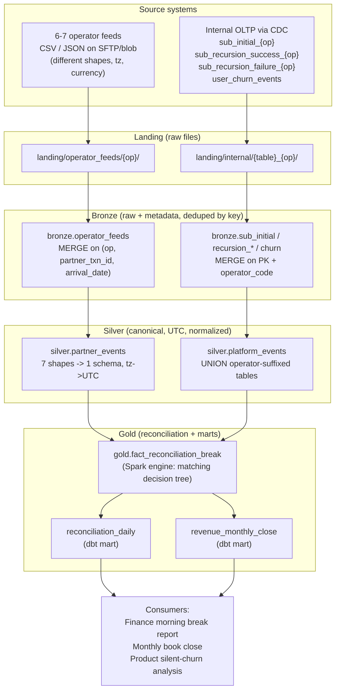
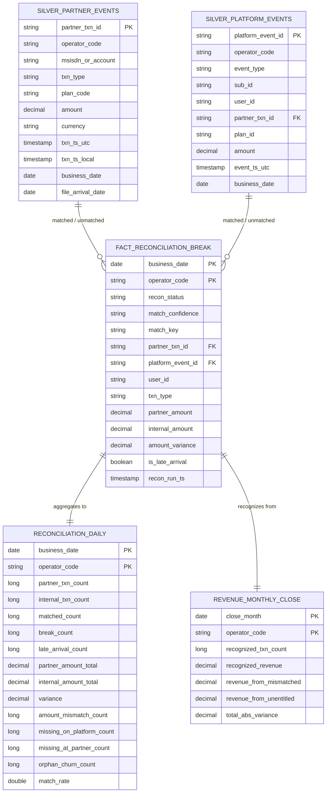
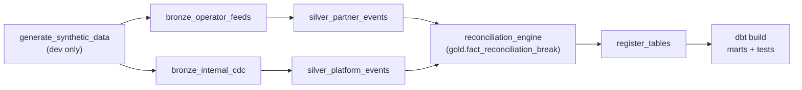

# Tapmad — Payments Reconciliation Pipeline

> Lead Data Engineer take-home, **Case Study A/B: Payments reconciliation across
> partner and internal systems.**

---

## TL;DR (30 seconds)

Tapmad bills subscribers through 6–7 operators. Every charge exists twice: once
at the **operator** (the source of truth for money) and once in the **internal
platform** (the source of truth for entitlement). The two drift. This pipeline
ingests both sides daily, normalizes 6–7 differently-shaped feeds into one
canonical schema, **matches partner ↔ platform transactions through a 3-tier
decision tree**, classifies every disagreement, and produces:

- `gold.fact_reconciliation_break` — one row per reconciled unit (the drill-down)
- `reconciliation_daily` — the summary **Finance opens each morning**
- `revenue_monthly_close` — the recognized-revenue figure for the **book close**

Built on **PySpark + Delta Lake + dbt + Airflow** (the stack I run today).
Tapmad runs Azure Fabric/Databricks — the port is mechanical
([§ 12](#12-migration-to-azure-in-brief)): the logic moves over **unchanged**,
only storage paths and the orchestrator wrapper change.

---

## 1. How I interpreted the problem

The brief is really three problems wearing one coat:

1. **Integration** — 6–7 operator feeds, each a different shape/timezone/
   currency, plus a per-operator-suffixed internal OLTP. Get them into one
   comparable shape.
2. **Reconciliation** — decide what "the same transaction" *means* when the
   shared key is sometimes missing, amounts are off by rounding, and operators
   re-send last week's data. This is the hard part, and it's a **definitions**
   problem before it's a SQL problem.
3. **Trust** — Finance closes the books on this output and must be able to
   **restate any past day** with late data **without changing a closed month**.
   That makes idempotency and auditability first-class requirements, not nice-to-haves.

Everything below is organized around those three.

---

## 2. Architecture at a glance

A standard **medallion** (bronze → silver → gold) lakehouse.



| Layer | What it holds | Engine | Idempotency mechanism |
|------|----------------|--------|------------------------|
| **Landing** | raw files as dropped | — | n/a |
| **Bronze** | raw rows + ingest metadata, schema-on-read | PySpark | `MERGE` on natural key |
| **Silver** | canonical, UTC, normalized events | PySpark | `replaceWhere` per `business_date` |
| **Gold (fact)** | reconciliation results, per-row | PySpark | `replaceWhere` per `business_date` |
| **Gold (marts)** | daily summary + monthly close | dbt | `reconciliation_daily` incremental per `business_date` (`replace_where` on Databricks, `insert_overwrite` locally); `revenue_monthly_close` full rebuild |

**Why this split of Spark vs dbt?** Bronze/silver/matching need imperative
control (timezone edge cases, multi-tier joins, window dedupe) — clearer and
faster in PySpark. The marts are SQL that **Finance can read, test, and trust**,
so dbt owns them with built-in tests and docs. This hybrid is exactly how I'd
run it on Databricks.

### Data model (ERD)

The two canonical silver streams (`partner_events`, `platform_events`) feed
`fact_reconciliation_break` — one row per reconciled unit (matched pair or
unmatched survivor) — which then rolls up into `reconciliation_daily` and
`revenue_monthly_close`.



### Orchestration (Airflow DAG)



---

## 3. Integration — turning 6–7 shapes into one schema

The whole "different shape per operator" problem is solved with **one
config-driven job**, not seven bespoke ones. See
[`spark/config/operator_config.py`](spark/config/operator_config.py).

Each operator gets one dict entry describing its column names, txn-type codes,
file format, timezone, currency, and timestamp encoding:

```python
"telco_b": {
    "file_format": "csv", "csv_options": {"sep": ";"},
    "timezone": "Asia/Karachi", "default_currency": "PKR",
    "column_map": {"txn_ref": "partner_txn_id", "charged_amount": "amount", ...},
    "txn_type_map": {"renewal_success": "recursion_success", ...},
    "ts_format": "yyyy-MM-dd'T'HH:mm:ss",
}
```

[`silver_operator_feeds.py`](spark/silver/silver_operator_feeds.py) drives every
operator through the same 6 steps: rename → map txn types → parse timestamp →
**convert local time to UTC** → derive `business_date` → cast amount.
**Onboarding operator #8 = add one dict entry, write zero new code.**

Three timestamp encodings are handled explicitly (easy to get wrong):
naive local strings (converted from the operator's tz to UTC),
ISO-8601 with offset (already an instant), and epoch-millis (already an
instant). Getting `business_date` right is what makes the operator-local vs
platform-UTC reconciliation honest.

**The internal operator-suffixed tables** (`sub_initial_telco_a`,
`sub_initial_telco_b`, …) are handled by stamping `operator_code` at bronze
ingest and then **`UNION`-ing by logical table in silver**
([`silver_internal_events.py`](spark/silver/silver_internal_events.py)). I chose
*union-at-read with an operator column* over dynamic table discovery because
it's explicit, testable, and trivially extends to new operators — see
[§ Decision log](#7-decision-log).

---

## 4. Reconciliation — the matching decision tree

This is the core. Full implementation:
[`spark/gold/reconciliation_engine.py`](spark/gold/reconciliation_engine.py).
The brief's tip says it out loud: *the hard part is deciding what "matched"
means.* Here's the tree:

```
For partner event P and platform event I:

TIER 1 — STRONG KEY MATCH  (confidence: strong)
  P.partner_txn_id == I.partner_txn_id  (same operator)
  └─ amounts within tolerance?  → MATCHED
     else                       → AMOUNT_MISMATCH

TIER 2 — FALLBACK COMPOSITE  (confidence: fallback)
  only when I.partner_txn_id IS NULL (key never existed to join on)
  match on operator + txn_type + business_date(±1d) + amount(in tolerance)
  guard fan-out: keep the single closest-amount candidate (row_number=1)
  → MATCHED, tagged match_confidence='fallback' so Finance sees the heuristic

TIER 3 — NO MATCH → classify the survivor
  partner row,  no platform counterpart → MISSING_ON_PLATFORM
  platform row, no partner counterpart  → MISSING_AT_PARTNER
        (recursion_failure excluded — an expected non-charge, not a break)

CROSS-CUTTING
  ORPHAN_CHURN  — user churned on platform but operator still billed → re-tag
  LATE_ARRIVAL  — file_arrival_date > business_date + 2d; folded into the
                  ORIGINAL period and flagged (closed months restate cleanly)
```

**Amount tolerance** (`RECON_CONFIG` in operator_config.py): a match passes if
*either* the absolute diff ≤ 0.01 *or* the relative diff ≤ 0.5%. That absorbs
sub-cent decimal/FX rounding without masking real discrepancies. Every number
is a named config value in one place, so the thresholds are easy to find and tune.

**False-positive control on the fallback tier:** no shared id means risk, so I
require amount agreement **and** a tight ±1-day window **and** a 1:1 pairing
(the closest-amount candidate wins; no fan-out). The match is then *labeled*
`fallback` so it's never silently trusted.

The output `fact_reconciliation_break` carries **both** the partner and internal
amount on every row, so the marts compute totals/variance without re-joining,
and every row keeps `partner_txn_id` / `platform_event_id` as an **audit trail
back to source**.

---

## 5. Trust — idempotency, late arrivals, restatement

These three requirements are the difference between a demo and something
Finance can close books on.

**Idempotency (operators re-send 3 days of corrections).**
- Bronze `MERGE`s on the natural key → a re-sent row updates in place, never
  appends a duplicate. ([`delta_utils.merge_upsert`](spark/utils/delta_utils.py))
- Silver/Gold use Delta **`replaceWhere "business_date = X"`** → recomputing a
  day atomically swaps *only that day's* partition. Re-running is deterministic.
- A dbt data test [`assert_no_double_counting.sql`](dbt/tests/assert_no_double_counting.sql)
  fails the build if any `partner_txn_id` is ever counted twice.

**Late arrivals (txn lands 2+ days after close).** `business_date` is derived
from the **transaction's UTC time**, *not* its file-arrival date. So a row that
lands late still carries its original `business_date`; the backfill re-runs that
day, `replaceWhere` swaps the partition, and the number **restates correctly**.
The row is additionally tagged `LATE_ARRIVAL` / `is_late_arrival = true` so
Finance knows a closed period received late data.

**Re-statable history without disturbing closed months.** Because each
`business_date` is an independent partition and every write is a scoped replace,
re-running 2024-01-10 touches *only* 2024-01-10. The Airflow backfill of any
past date is a clean restatement — closed months are never mutated as a side
effect. (For a hard freeze, add a `closed_periods` guard table; noted in
[§ With more time](#9-what-id-do-with-more-time).)

---

## 6. The final deliverables (mapped to the brief)

The brief asks for a `reconciliation_daily` mart with specific columns and an
FK to a break-detail table. Delivered:

**`reconciliation_daily`** ([model](dbt/models/marts/reconciliation_daily.sql)) — one row per `(business_date, operator_code)`:
`partner_txn_count`, `internal_txn_count`, `matched_count`, `break_count`,
`partner_amount_total`, `internal_amount_total`, `variance`, plus counts by
category (`amount_mismatch_count`, `missing_on_platform_count`,
`missing_at_partner_count`, `orphan_churn_count`) and a `match_rate` for
alerting. Drill down via `(business_date, operator_code)` into…

**`fact_reconciliation_break`** ([engine](spark/gold/reconciliation_engine.py)) — the individual mismatched rows, with `recon_status`,
`match_confidence`, both amounts, variance, and source ids for audit.

**`revenue_monthly_close`** ([model](dbt/models/marts/revenue_monthly_close.sql)) — recognized revenue per month/operator with an explicit,
documented recognition policy and audit columns showing how much rests on
imperfect rows.

---

## 7. Decision log

| Decision | Chose | Over | Why |
|----------|-------|------|-----|
| Operator-suffixed table join | `UNION` + `operator_code` column at bronze | dynamic table discovery | explicit, testable, schema-on-read; new operator = config only |
| Normalization placement | silver, config-driven | per-operator jobs | one code path; 7 shapes is data, not branches |
| `business_date` source | transaction UTC time | file_arrival_date | makes late arrivals restate into the right period |
| Matching when key missing | composite fallback, **labeled & guarded** | drop, or trust blindly | recovers real matches without hiding the risk |
| Amount equality | abs 0.01 **or** rel 0.5% | exact equality | absorbs rounding/FX without masking breaks |
| recursion_failure | excluded from "missing at partner" | treat as break | it's an expected non-charge; otherwise false breaks |
| Idempotency | Delta `MERGE` + `replaceWhere` | append + dedupe later | deterministic re-runs, no double count, atomic |
| Marts engine | dbt | more PySpark | SQL Finance can read + tested + documented |
| Spark for matching | PySpark | dbt SQL | window dedupe + multi-tier joins clearer/faster |

---

## 8. Quick start (Docker)

Everything runs in containers — no local Python, Java, or Spark needed. Spark
runs in `local[*]` mode inside the image, and dbt builds the marts against that
same in-container Spark (no warehouse required). **Only prerequisite: Docker +
Docker Compose.**

### The data is already generated

The raw inputs are committed under [`data/sample/`](data/sample), so you don't
have to generate anything to get started. They were produced once with:

```bash
LAKEHOUSE_ROOT=data/sample python data/synthetic/generate_data.py \
  --business-date 2024-01-15 --n 150
```

The generator uses a fixed random seed, so this is deterministic — the
container regenerates the *identical* dataset when it runs, so what you inspect
in `data/sample/` is exactly what the pipeline processes.

**What's in the landing data:**

| Folder | Contents |
|--------|----------|
| `data/sample/landing/operator_feeds/<operator>/` | the 6 partner feeds, each in its **raw** shape — `telco_a` / `telco_b` / `telco_d` / `wallet_y` CSV (comma / semicolon / epoch-millis / comma), `telco_c` & `wallet_x` JSON (with `+04:00` offset / UTC `Z`). The `*_20240118.csv` files are **late arrivals** (business_date 2024-01-15, landed the 18th). |
| `data/sample/landing/internal/<table>_<operator>/` | the internal OLTP CDC as JSON — `sub_initial_*`, `sub_recursion_success_*`, `sub_recursion_failure_*`, plus shared `user_churn_events`. |

### Run it

```bash
# 1. build the images (first run pulls base images + caches the Delta jars)
docker compose build

# 2. run the pipeline: generate -> ingest -> normalize -> reconcile (prints a summary)
docker compose run --rm pipeline

# 3. build the Finance marts + data tests (dbt on the in-container Spark)
docker compose run --rm dbt

# optional: the full Airflow experience (UI at http://localhost:8080, airflow/airflow)
docker compose --profile airflow up -d
```

`make build` / `make pipeline` / `make dbt` / `make airflow-up` are shortcuts for
the same commands. To point dbt at a real warehouse instead of local Spark, set
`DBT_TARGET=databricks` plus `DATABRICKS_HOST` / `DATABRICKS_HTTP_PATH` /
`DATABRICKS_TOKEN`.

### Where the output lands

`lakehouse/` is bind-mounted to your machine, so every layer is written to
`./lakehouse/` as the pipeline runs:

- `./lakehouse/bronze|silver|gold/` — the Delta tables (parquet part-files + a
  `_delta_log/`).
- `./lakehouse/exports/<layer>/<table>/` — clean single-file **Parquet**
  snapshots of each bronze / silver / gold table, written by the final
  `spark.export_parquet` step for easy local inspection.
- `./lakehouse/exports/marts/<table>/` — Parquet snapshots of the dbt marts
  (`reconciliation_daily`, `revenue_monthly_close`), written by the `dbt`
  service after `dbt build`.

(`lakehouse/` is git-ignored — it's generated output, not committed.)

### How the data is transformed

Both `pipeline` and `dbt` containers share one `lakehouse` Delta volume, so each
step reads what the previous one wrote. Following one `business_date` through:

| Step (code) | Reads | Writes | What it does |
|-------------|-------|--------|--------------|
| **landing** | — | `lakehouse/landing/` | the raw operator + internal files (the container generates them here on run) |
| **bronze** (`spark/ingestion/`) | landing | `lakehouse/bronze/` | lands raw rows + ingest metadata; **`MERGE` on natural key** so re-sent corrections never duplicate |
| **silver** (`spark/silver/`) | bronze | `lakehouse/silver/partner_events`, `…/platform_events` | normalizes the 6–7 shapes into **one canonical schema**, converts each operator's local time → **UTC**, derives `business_date`; unions the operator-suffixed internal tables into one stream |
| **gold — engine** (`spark/gold/`) | silver | `lakehouse/gold/fact_reconciliation_break` | the **3-tier matcher** (strong key → fallback → classify) tags every row `MATCHED` / `AMOUNT_MISMATCH` / `MISSING_ON_PLATFORM` / `MISSING_AT_PARTNER` / `ORPHAN_CHURN` / `LATE_ARRIVAL` |
| **register** (`spark/register_tables.py`) | gold fact | local Hive metastore | registers the silver/gold Delta paths as catalog tables so dbt's session target can read them (no-op on Databricks/Unity Catalog) |
| **gold — marts** (`dbt/`) | silver + gold fact | `reconciliation_daily`, `revenue_monthly_close` | per-day/per-operator summary Finance opens each morning + the monthly recognized-revenue close; dbt tests assert no double-counting and matched-row balance |

The `pipeline` container ends by printing a count of rows **per `recon_status`**
for the day (MATCHED, AMOUNT_MISMATCH, MISSING_ON_PLATFORM, MISSING_AT_PARTNER,
ORPHAN_CHURN, LATE_ARRIVAL) — a quick read on the day's break profile. The
per-operator counts, totals, and variance live in `reconciliation_daily`.

---

## 9. What I'd do with more time

Honest list of what I deliberately deferred under the 72-hour window:

- **`closed_periods` freeze table** — a hard guard so a backfill into a
  *signed-off* month requires an explicit adjustment record rather than silently
  restating. Today closed months are protected by partition isolation but not
  formally locked.
- **Currency → reporting currency** — I normalize to operator-local currency and
  reconcile within an operator. A real close needs an FX-rate dimension to roll
  multi-currency operators into one reporting currency (PKR/USD).
- **Auto Loader / DLT ingestion** on Azure instead of the local `glob` reader,
  with schema-evolution and exactly-once file tracking.
- **Fuzzy MSISDN resolution** for the fallback tier (number portability,
  account-id changes) backed by a stable user-mapping dimension.
- **SCD2 on subscription state** to answer "what was the entitlement on date X"
  for historical restatement, not just current status.
- **Data-quality expectations** (Great Expectations / DLT expectations) on the
  bronze→silver boundary, surfacing the `unknown` txn_type bucket as alerts.
- **Reconciliation SLAs & alerting** — page when `match_rate` drops below a
  per-operator threshold or `break_count` spikes.
- **Property-based tests** on the matching engine (generate adversarial
  amount/date/key combinations and assert classification invariants).

---

## 10. Repository layout

```
tapmad-reconciliation/
├── README.md                        ← you are here
├── requirements.txt
├── docker-compose.yml               ← full stack: pipeline + dbt + Airflow
├── Makefile                         ← make build / pipeline / dbt / airflow-up
├── docker/                          ← Dockerfiles, run_pipeline.sh, spark-defaults
├── data/
│   ├── synthetic/generate_data.py   ← plants every reconciliation scenario
│   └── sample/                      ← pre-generated landing data (2024-01-15)
├── spark/
│   ├── config/operator_config.py    ← the 6 operator shapes + recon knobs
│   ├── config/paths.py              ← medallion paths (only file Azure changes)
│   ├── utils/                       ← spark session + Delta idempotency helpers
│   ├── ingestion/                   ← bronze: operator feeds + internal CDC
│   ├── silver/                      ← canonical normalization + union
│   ├── gold/reconciliation_engine.py← THE matching decision tree
│   └── register_tables.py           ← expose Delta paths to dbt (local metastore)
├── dbt/
│   ├── models/staging/              ← typed views over silver + gold fact
│   ├── models/intermediate/         ← pivots + independent source counts
│   ├── models/marts/                ← reconciliation_daily, revenue_monthly_close
│   └── tests/                       ← no-double-counting, matched-balance
└── airflow/dags/                    ← daily DAG (= backfill/restatement)
```

---

## 11. A note on the stack choice

The brief prefers PySpark + Delta on Azure Fabric and says alternatives are fine
with an explanation of how they translate. I used **open-source Spark + Delta +
dbt + Airflow** because that's what I run day-to-day and it lets the whole thing
run locally. The Spark and Delta fundamentals are all
here — config-driven normalization, joins across operator-suffixed tables,
window-function dedupe, partitioning by `business_date`, and idempotent
`MERGE` / `replaceWhere` writes. The port to Azure is mechanical
([§ 12](#12-migration-to-azure-in-brief)): business logic unchanged, only
storage paths and the orchestrator wrapper move.

---

## 12. Migration to Azure (in brief)

Tapmad runs PySpark on **Azure Fabric with ADLS Gen2**. Since the pipeline is
already Spark + Delta with idempotent partition writes, the move is about *where
it runs and where data lives* — the business logic doesn't change:

- **Storage** — local lakehouse paths → **ADLS Gen2** (`abfss://…`), tables in
  **Unity Catalog**. Realistically one file changes: `spark/config/paths.py`.
- **Compute** — the `spark/` jobs run unchanged as **Databricks / Fabric**
  notebooks or jobs (`get_spark()` already returns the cluster session).
- **Ingestion** — the local file reader → **Azure Data Factory** (operator SFTP)
  + **CDC into ADLS** (or Auto Loader for incremental file pickup).
- **Orchestration** — the Airflow DAG → **Databricks Workflows** or **ADF**;
  same task graph, only the operator type changes.
- **dbt** — flip the target to `databricks` (already in `dbt/profiles.yml`).
