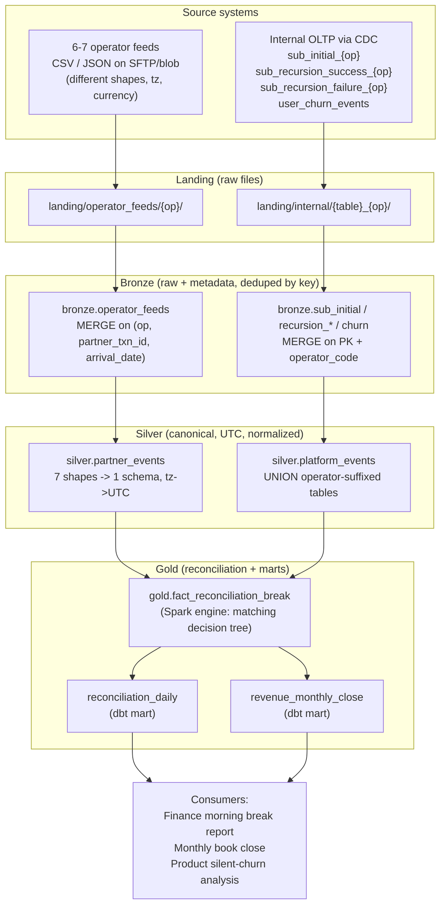
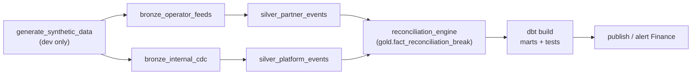

# Architecture

End-to-end data flow, medallion layout, orchestration, and the consumer.
The Mermaid diagrams below render directly on GitHub/GitLab.

## Pipeline flow



## Orchestration (Airflow DAG)



## Tooling per layer

| Layer | Engine | Why |
|-------|--------|-----|
| Bronze | PySpark + Delta | schema-on-read flexibility for 7 shapes; MERGE for idempotency |
| Silver | PySpark + Delta | imperative control for tz/format edge cases and the canonical union |
| Gold — fact | PySpark + Delta | window functions + multi-tier matching are clearer/faster in Spark |
| Gold — marts | dbt (Databricks) | SQL Finance can read, tested + documented, incremental replace_where |
| Orchestration | Airflow | dependency graph, retries, backfill = restatement |
| Storage | Delta Lake | ACID, partition replace, time travel for audit |
```
