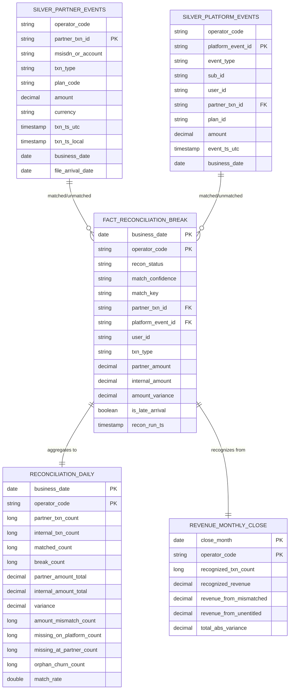

# Data Model (ERD)

Two parallel canonical streams (partner vs platform) feed the reconciliation
fact, which rolls up into the daily mart and the monthly close.



## Grain notes
- `silver_partner_events`: one row per operator transaction (money moved).
- `silver_platform_events`: one row per internal money-moving event
  (subscription_success / recursion_success), unioned across all
  operator-suffixed OLTP tables. recursion_failure carried separately for
  explanation, churn carried for orphan detection.
- `fact_reconciliation_break`: one row per reconciled unit — a matched pair,
  an unmatched partner row, or an unmatched platform row. This is the
  drill-down detail; `partner_txn_id` / `platform_event_id` trace to source.
- `reconciliation_daily`: one row per (business_date, operator_code).
- `revenue_monthly_close`: one row per (close_month, operator_code).
```
